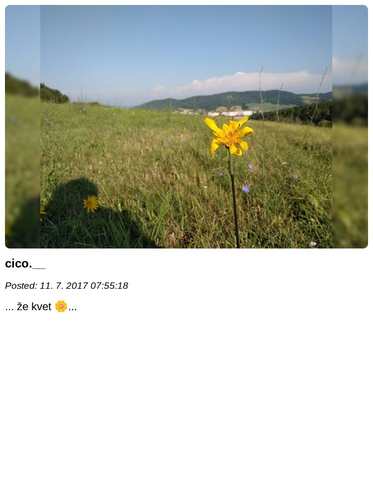

# Instagram Content Downloader

## Motivation

The main purpose of the project was to make quick script, which will be able to do following:

-   [x] Download images from instagram using Instagram / Meta API
-   [x] Download content for those images
-   [x] Download albums
-   [x] Generate Instagram-like images (locally on the server) with blurred background (of the same image)
    -   the images have 4/3 aspect ratio
    -   automatic width / height adjustment, as not all images on instagram are 4/3 format
-   [x] Save "cropped" images with the content that fits to the programatically defined dimensions
-   [x] Save images with whole content by adjusting max height of generated image if content wouldn't fit on the cropped image (cropped image is generated as well)
-   [x] Emojis support

## Image processing

### Jimp

-   quite easy to work, but much slower and most likely outdated

### SharpJS

-   significantly faster, expected to use for image generation

## What the hell that somehow ugly looking MVC model ?

Well, as it was fun project, I told myself, why not to try implement something very simple MVC model with "view" files, that is possible to output. Just ignore it :) .

## I want to use it

Sure, go on. It would be nice, if you would at least let me know, so I have a feedback, that someone wants to try it out :). Setup might be a bit complicated.

1.  You will need development access to `developers.facebook.com`, where you create your own app and set it up properly:

    -   Allowing `Instagram Basic Display`
    -   inside `Basic Display` settings, you will have to manually add `https` based hooks

        -   app uses following URLs:

            <br>

            | Functionality             | URL           |
            | ------------------------- | ------------- |
            | Valid OAuthRedirect URI   | /auth/        |
            | Deauthorize callback URL  | /deauth/      |
            | Data Deletion Request URL | /delete-data/ |

        -   you will need to add all of them, even though Deletion is most likely not implemented

2.  `cp .env.example .env`

    | ENV var.      | WHER to find it                                                                                         |
    | ------------- | ------------------------------------------------------------------------------------------------------- |
    | CLIENT_TOKEN  | "Client token" in https://developers.facebook.com/apps/{ID}/settings/advanced/                          |
    | CLIENT_ID     | "Instagram App ID" https://developers.facebook.com/apps/{ID}/instagram-basic-display/basic-display/     |
    | CLIENT_SECRET | "Instagram App Secret" https://developers.facebook.com/apps/{ID}/instagram-basic-display/basic-display/ |
    | DOMAIN        | Your domain name e.g. `localhost`                                                                       |
    | PORT          | port of the app, e.g. `443`                                                                             |

3.  to run the app: `npm run serve`
4.  Visit the app on accurate URL and PORT.
5.  Login to instagram
6.  Click that you want to fetch the data
7.  Wait for data being fetched and enjoy your images (hopefully)

## Result

### Data

```json
{
    "id": "EXAMPLE_ID",
    "caption": "... že kvet 🌼...",
    "media_url": "https://scontent-cph2-1.cdninstagram.com/v/EXAMPLE_URL",
    "media_type": "IMAGE",
    "timestamp": "2017-07-11T05:55:18+0000"
},
```

### Final Image

